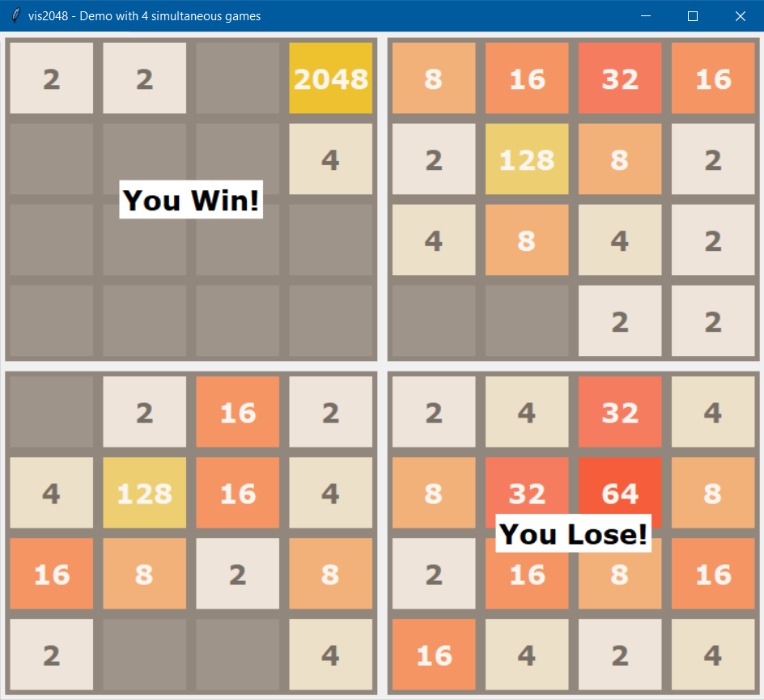

# vis2048

An implementation of [2048](http://2048game.com) with visualization support and extensive tests.

## Testing

Execute `./tests/test.py` to run the tests that are based on the built-in `unittest` module.

## License
MIT.
